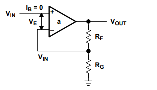

## 3.1: Ideal Op amps
Several assumptions must be made:
- "assume that the current flow into the input leads of the op amp is ~zero"
- "op amp gain is assumed to be infinite, hence it drives the output voltage to any value to satisfy the input conditions"
- "leads to the third assumption that the voltage between the input leads is zero. The implication of zero voltage between the input leads means that if one input is tied to a hard voltage source such as ground, then the other input is at the same potential"
- "the output impedance of the ideal op amp is zero. The ideal op amp can drive any load without an output impedance dropping voltage across it"
- "the frequency response of the ideal op amp is flat; this means that the gain does not vary as frequency increases" (holds true irl with lower freq's)

## 3.2 Noninverting Op amp

 
